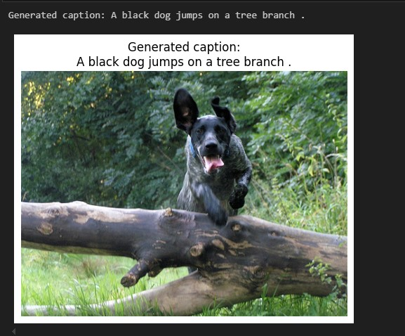

# 🖼️ BLIP2 Image Captioning – Fine-Tuned on Flickr8k

This project **fine-tunes a Vision-Language Model (BLIP2)** on the **Flickr8k dataset** to generate accurate and context-aware captions for images.  
It uses **quantization** and **LoRA (Low-Rank Adaptation)** for efficient training and inference, making it possible to run on limited hardware.

---

## 🚀 Features

✅ **BLIP2 Model Fine-Tuning** – Adapted `blip2-opt-2.7b` for Flickr8k captions.  
✅ **LoRA + Quantization** – Reduced memory footprint for faster training and inference.  
✅ **Custom PyTorch Dataset** – Prepares images + captions dynamically for the model.  
✅ **Efficient Training Loop** – Supports mixed precision training for speed.  
✅ **Real-Time Inference** – Generates human-like captions for unseen images.  
✅ **Visualization** – Displays image with predicted caption using `matplotlib`.

---

## 🖼 Project Screenshot

  

---

## 🛠 Technologies Used

- **Python** – Core development
- **PyTorch** – Training & fine-tuning
- **Hugging Face Transformers** – BLIP2 Model & Tokenizer
- **BitsAndBytes** – 8-bit quantization for memory efficiency
- **PEFT (LoRA)** – Parameter-efficient fine-tuning
- **Pandas** – Caption dataset processing
- **Matplotlib** – Visualization of results

---

## 📦 How to Run

1️⃣ Open this project in **Google Colab**  
2️⃣ **Upload your `kaggle.json`** file to Colab  
3️⃣ Run the cells in order to download the dataset, fine-tune BLIP2, and generate captions  

---
